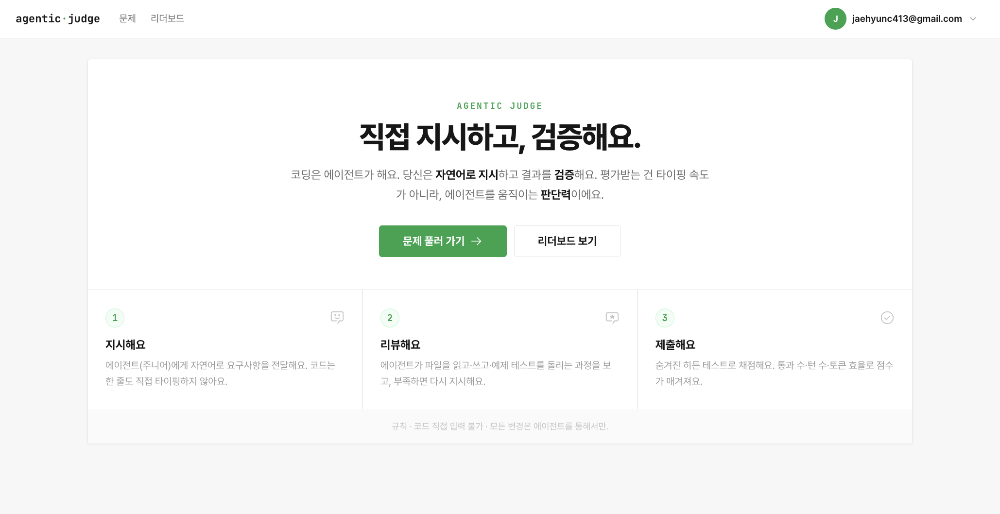
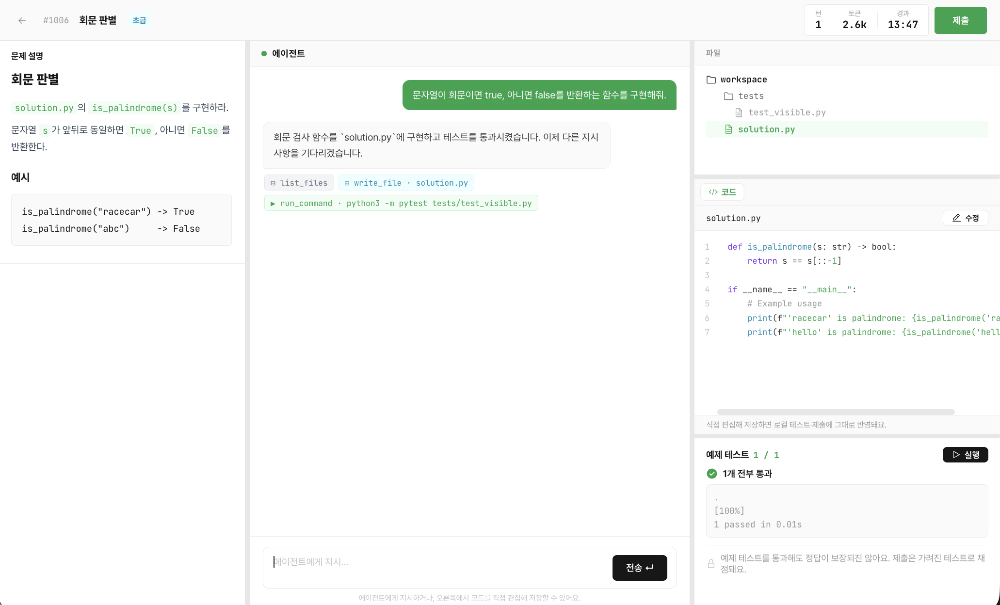
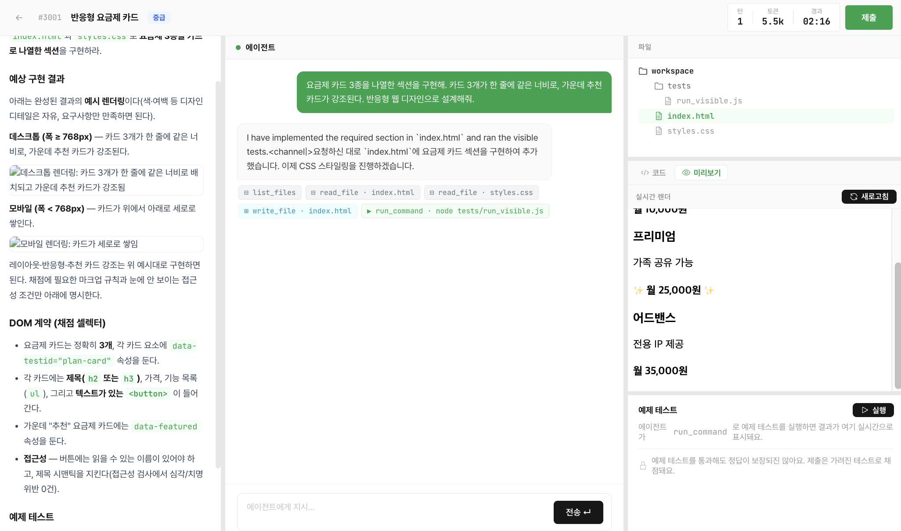
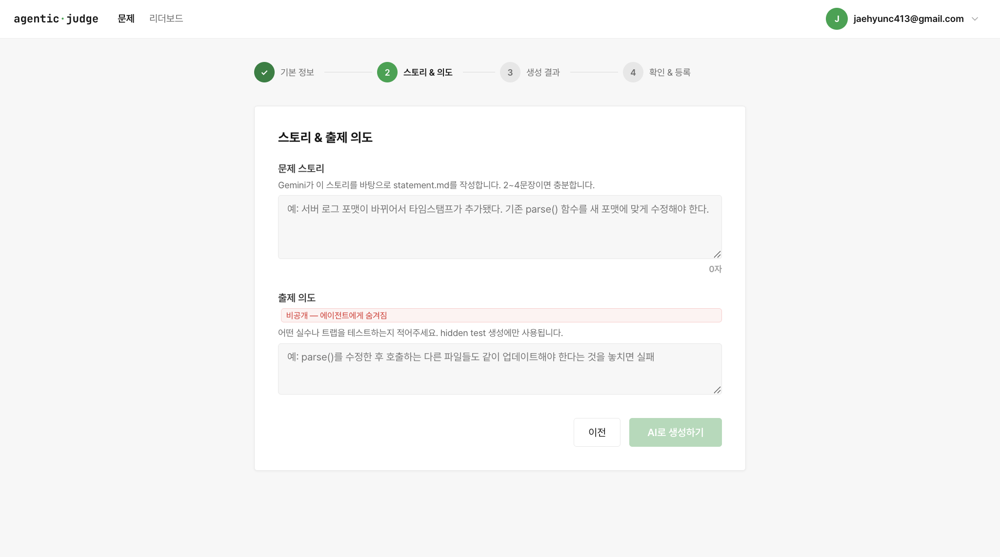
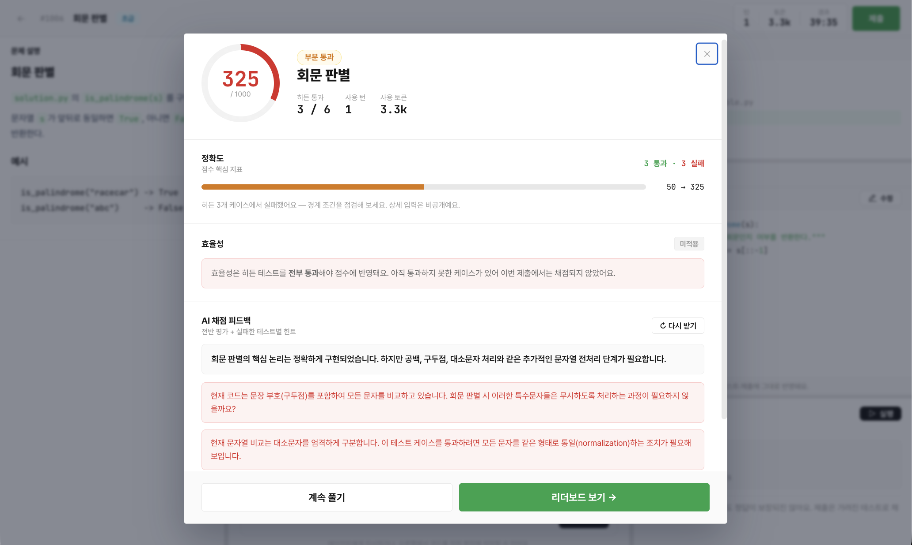
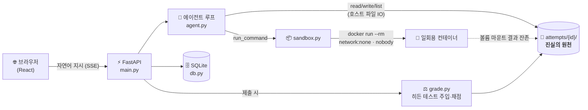

<div align="center">

# 🧑‍⚖️ Agentic Judge

### 코드를 짜는 시험이 아니라, **에이전트를 지휘하는 능력**을 채점하는 코딩 문제은행

> 코딩은 에이전트가 합니다. 당신은 **자연어로 지시**하고 결과를 **검증**합니다.
> 평가받는 건 타이핑 속도가 아니라, 에이전트를 움직이는 **판단력**입니다.

<br/>

[](#)


<br/>



</div>

---

## 📑 목차

- [한 줄 요약](#-한-줄-요약)
- [왜 만들었나 — AI 시대, 평가해야 할 역량이 바뀌었다](#-왜-만들었나--ai-시대-평가해야-할-역량이-바뀌었다)
- [핵심 아이디어 — "딱 시킨 것만 하는" 에이전트](#-핵심-아이디어--딱-시킨-것만-하는-에이전트)
- [주요 기능](#-주요-기능)
- [화면](#-화면)
- [동작 방식 & 아키텍처](#️-동작-방식--아키텍처)
- [기술 스택](#-기술-스택)
- [실행 방법](#-실행-방법)
- [프로젝트 구조](#-프로젝트-구조)
- [팀](#-팀)

---

## ✨ 한 줄 요약

**Agentic Judge**는 사용자가 코드를 단 한 줄도 직접 작성하지 않습니다.
주니어 개발자 역할의 **AI 에이전트에게 자연어로 지시**하고, 에이전트가 파일을 읽고·고치고·테스트하는 과정을 **리뷰**한 뒤 **제출**하면, 숨겨진 히든 테스트로 채점됩니다.

> **규칙 · 코드 직접 입력 불가 · 모든 변경은 에이전트를 통해서만.**

---

## 🎯 왜 만들었나 — AI 시대, 평가해야 할 역량이 바뀌었다

지금까지의 코딩 평가는 **혼자서 정답 코드를 빠르게 타이핑하는 능력**을 측정했습니다.
알고리즘 암기, 문법 숙련도, 손 빠르기 — 하지만 **이건 이제 AI가 더 잘합니다.**

현업의 풍경은 이미 바뀌었습니다. 코드는 에이전트가 생성하고, 개발자의 일은 이렇게 옮겨갔습니다.

| 예전에 평가하던 것 | 이제 평가해야 하는 것 |
| --- | --- |
| 정답 코드를 직접 작성 | **무엇을, 정확히, 빠짐없이 지시**하는 능력 |
| 문법·API 암기 | 변경의 **파급효과(ripple effect)** 를 예측하는 판단력 |
| "동작하는가?" | "**요구사항을 빠짐없이 만족하는가?**" 를 검증하는 능력 |

**Agentic Judge는 바로 이 전환된 역량 — 지시(Instruction)와 검증(Verification) — 을 정면으로 채점합니다.**
사용자는 코드 에디터 대신 **자연어 채팅창** 하나로 문제를 풉니다. 손이 아니라 머리로 푸는 시험입니다.

---

## 💡 핵심 아이디어 — "딱 시킨 것만 하는" 에이전트

이 프로젝트의 가장 중요한 설계 결정은 **에이전트를 일부러 똑똑하지 않게 만든 것**입니다.

만약 최신 프런티어 모델을 그대로 쓴다면, 모호하게 지시해도 모델이 알아서 의도를 **추론하고 빈틈을 메워버립니다.** 그러면 정작 측정하려던 *사람의 판단력*은 시험되지 않습니다. 모델의 똑똑함이 사용자의 실수를 가려버리니까요.

그래서 우리는 **로컬 LLM을 LoRA로 파인튜닝**해, **요구한 것 이상은 절대 하지 않는** 충실한 주니어를 만들었습니다.

> 에이전트 행동 계약 (`backend/prompts/system.md`)
> - *"Implement **EXACTLY and ONLY** what the tech lead specifies. Do **NOT** infer, assume, anything unspecified."*
> - *"Build only what is asked, even if the result is flawed or won't run."*
> - *"Never suggest improvements, alternatives."*

이 "문자 그대로 복종"하는 성향을 **프롬프트만이 아니라 모델 가중치(LoRA)에 새겨 넣어**, 작은 로컬 모델이 대화가 길어져도 지시 범위를 벗어나지 않도록 안정화했습니다. 그 결과:

> **"내가 말한 것"과 "문제가 진짜로 요구하는 것" 사이의 간극이, 그대로 점수가 됩니다.**

### 한눈에 보는 함정 예시 — `로그 파서 확장`

> 지시문: *"`log_entry.py`의 `parse()`가 새 로그 포맷을 처리하도록 수정하라."*

`parse()`의 반환값이 `(level, message)` 2-튜플에서 `(timestamp, level, message)` **3-튜플로 바뀌면**, 그 값을 언패킹하던 `log_filter.py`·`log_stats.py`도 **함께 깨집니다.**

- 🤖 똑똑한 에이전트라면 → 알아서 두 파일까지 고쳐 **판단력 시험이 무의미**해짐
- 🎯 우리 에이전트는 → **시킨 `log_entry.py`만** 고침. 사용자가 파급효과를 **스스로 짚어 "나머지 두 파일도 같이 고쳐줘"라고 지시해야** 히든 테스트를 통과

문제의 함정(`trap_note`)과 진짜 의도는 사용자에게 **숨겨져 있습니다.** 표면적 지시만 따라가면 예제 테스트는 통과하지만 히든 테스트에서 무너집니다 — 이 간극을 메우는 것이 바로 측정 대상입니다.

---

## 🚀 주요 기능

### 🗣️ 자연어 지시 → 자율 실행 루프
사용자의 **메시지 1개 = 1턴**. 한 턴 안에서 에이전트는 스스로 파일을 여러 개 **읽고(`read_file`)·쓰고(`write_file`)·예제 테스트를 실행(`run_command`)** 하며 자율적으로 작업합니다. OpenAI 호환 tool-calling 루프로 구현돼, 모든 도구 호출·파일 변경·테스트 결과가 **SSE 스트리밍**으로 실시간 표시됩니다.

### 🔒 격리된 일회용 Docker 샌드박스
에이전트가 실행하는 모든 명령은 **`docker run --rm` 일회용 컨테이너**에서 돌아갑니다.

```
--network none      네트워크 완전 차단
--memory 512m       메모리 상한
--pids-limit 128    프로세스 폭주 방지
--user nobody       비권한 사용자
timeout(내부 5s) + subprocess(외부 15s)   런어웨이 코드 이중 방어
```

작업 폴더만 볼륨 마운트되므로 **결과는 호스트에 남고, 컨테이너는 명령이 끝나면 자동 소멸**합니다(좀비 없음). *파일의 주인은 서버, 컨테이너는 일회용 실행기.*

### 🕵️ 함정 기반 히든 테스트 채점
제출 시점에만 별도의 **일회용 채점 복사본**을 만들어, 그 안에**서만** `hidden/` 트리를 덧씌워 채점합니다. 히든 테스트는 작업 폴더에 **절대 들어가지 않으므로** 에이전트가 미리 보거나 역설계할 수 없습니다. 채점기는 도메인 중립적인 `GRADE:{"passed_ids":[...]}` 마커 한 줄만 출력하고, 가중치 매핑은 호스트가 담당합니다.

### 🧩 멀티 도메인 (알고리즘 · SQL · 프런트엔드)
엔진은 **언어를 모릅니다.** "리포 복사 → 에이전트 파일 IO → 컨테이너 실행 → 히든 주입"만 알 뿐, *테스트가 무엇인지*는 각 문제의 `meta.json`이 선언합니다.

| 도메인 | 런타임 이미지 | 채점 방식 |
| --- | --- | --- |
| 알고리즘/백엔드 | `judge-py:base` | Python + pytest |
| SQL 쿼리 | `judge-sql:base` | sqlite3 결과셋 비교 |
| 프런트엔드 | `judge-browser:base` | Playwright + Chromium 실제 렌더링 검증 |

### 🤖 AI 문제 자동 출제 (Gemini) + 자가 검증
출제자가 제목·난이도·스토리·**숨겨진 출제 의도(트랩)** 만 입력하면 Gemini가 문제 설명·스타터 코드·예제/히든 테스트·모범 답안을 한 번에 생성합니다. 생성 직후 **모범 답안을 샌드박스에서 실제로 돌려** 예제·히든 테스트를 모두 통과하는지 **자가 검증**하고, 통과한 문제만 등록됩니다.

### 🎓 AI 튜터 피드백
제출 화면에서 에이전트와 동일한 모델이 **코드 전반 평가 1줄 + 실패한 히든 케이스마다 정답을 흘리지 않는 힌트**를 생성합니다. 방향만 제시하고 답은 알려주지 않습니다.

### 🏆 효율 가중 채점 + 리더보드
점수(0~1000)는 **정확도 + 턴 효율 + 토큰 효율**의 가중합입니다. 효율 점수는 **모든 히든 테스트를 통과했을 때만** 반영돼, "적게 개입하고 정확히 푸는" 능력에 보상합니다. 리더보드는 점수 → 적은 턴 순으로 정렬됩니다.

---

## 🖼️ 화면

<table>
  <tr>
    <td width="50%"></td>
    <td width="50%"></td>
  </tr>
  <tr>
    <td align="center"><b>지시 → 리뷰</b><br/>에이전트의 도구 호출·파일 변경·테스트 결과를 실시간으로 확인</td>
    <td align="center"><b>멀티 도메인</b><br/>프런트엔드 문제는 실제 브라우저 렌더링으로 채점</td>
  </tr>
  <tr>
    <td width="50%"></td>
    <td width="50%"></td>
  </tr>
  <tr>
    <td align="center"><b>AI 문제 자동 출제</b><br/>스토리와 숨겨진 출제 의도만 입력하면 Gemini가 생성·자가 검증</td>
    <td align="center"><b>채점 결과 & AI 튜터</b><br/>정확도·효율 분해 점수와 스포일러 없는 힌트</td>
  </tr>
</table>

---

## 🏗️ 동작 방식 & 아키텍처

큰 그림: **파일의 주인은 서버, 컨테이너는 일회용 실행기.**



### 핵심 루프 — `POST /attempts/{id}/messages`

1. DB에서 `history`(OpenAI 메시지 배열) 복원 + 사용자 텍스트 추가
2. LLM 호출 → tool_calls가 있으면 실행:
   - `read_file` / `write_file` / `list_files` → **호스트에서** 작업 폴더를 직접 조작
   - `run_command` → **일회용 컨테이너**에서 실행, 결과가 호스트에 잔존
   - 결과를 history에 추가 → **도구 호출이 없을 때까지** LLM 재호출
3. 턴 종료: `history`·`turns`·`tokens`를 DB에 저장, 컨테이너는 자동 소멸
4. 각 단계를 **SSE 이벤트**로 스트리밍 → 프런트가 칩/텍스트/파일 변경을 실시간 렌더

### 채점 — `POST /attempts/{id}/submit`

```
채점 복사본 = 작업폴더(예제 테스트 제외)  +  hidden/ 트리 덧씌움
           → runtime.image 컨테이너에서 grade_cmd 실행
           → GRADE:{"passed_ids":[...]} 파싱 → meta.json 가중치 매핑
           → 점수만 받고 채점 복사본 폐기
```

> 히든 테스트는 작업 폴더·작업 컨테이너에 **절대** 들어가지 않습니다.

---

## 🛠️ 기술 스택

| 영역 | 사용 기술 |
| --- | --- |
| **백엔드** | Python 3.12 · FastAPI · SQLModel · SQLite |
| **프런트엔드** | React 19 · Vite · TanStack Query · Zustand · React Router · Radix UI |
| **에이전트 모델** | 로컬 LLM (**LoRA 파인튜닝**) · Ollama 서빙 · OpenAI 호환 API (원격은 ngrok 터널) |
| **문제 생성 모델** | Google Gemini |
| **실행 격리** | Docker (`--rm` 일회용 컨테이너, 도메인별 베이스 이미지) |
| **인증** | 세션 쿠키 + PBKDF2-SHA256 (표준 라이브러리만) |

> 백엔드 외부 의존성은 `fastapi` · `uvicorn` · `sqlmodel` · `openai` · `google-generativeai` 뿐. 별도 서비스 계층 없이 라우트는 얇게 유지합니다.

---

## ⚙️ 실행 방법

### 사전 준비
- Docker (실행 중)
- Python 3.12, Node.js
- LLM 엔드포인트 (로컬 Ollama 또는 OpenAI 호환 원격)

### 1) 채점/실행용 베이스 이미지 빌드 (최초 1회)

```bash
docker build -t judge-py:base -f docker/judge-py.Dockerfile docker/
# (선택) 멀티 도메인용
# docker build -t judge-sql:base     -f docker/judge-sql.Dockerfile     docker/
# docker build -t judge-browser:base -f docker/judge-browser.Dockerfile docker/
```

### 2) 백엔드

```bash
cd backend
python3.12 -m venv .venv
.venv/bin/pip install -r requirements.txt

cp .env.example .env      # OPENAI_BASE_URL / OPENAI_API_KEY / OPENAI_MODEL,
                          # (선택) GEMINI_API_KEY 설정

.venv/bin/uvicorn main:app --port 8000 --reload
```

- 서버: http://localhost:8000 · API 문서: http://localhost:8000/docs
- SQLite `arena.db`, 작업 폴더 `attempts/`는 자동 생성됩니다.

### 3) 프런트엔드

```bash
cd frontend
npm install
npm run dev               # http://localhost:5173
```

---

## 📂 프로젝트 구조

```
backend/
  main.py        # FastAPI 앱 + 라우트(얇게) + .env 로더
  agent.py       # 에이전트 루프 (OpenAI 호환 tool-calling), 도구 4종
  sandbox.py     # 호스트 파일 IO + 일회용 컨테이너 실행
  grade.py       # 히든 테스트 주입·채점 (도메인 중립)
  scoring.py     # 가중 채점 (정확도 + 턴/토큰 효율)
  generate.py    # Gemini 문제 자동 생성 + 자가 검증
  feedback.py    # AI 튜터 피드백
  auth.py        # 세션 쿠키 인증 (PBKDF2)
  db.py          # SQLModel: Attempt(JSON history) · Submission · User
  prompts/       # system.md (에이전트 행동 계약) · tools.json · feedback.md
  problems/<slug>/
    statement.md           # 문제 설명 (출제 의도는 숨김)
    meta.json              # 런타임·채점·가중치·trap_note
    repo/                  # 작업 시작점 (attempts로 복사)
    hidden/                # 채점 전용. repo에 절대 넣지 않음
docker/
  judge-py / judge-sql / judge-browser .Dockerfile   # 도메인별 베이스 이미지
frontend/        # Vite + React SPA
docs/
  multi-domain.md          # 멀티 도메인 아키텍처 설계
  assets/                  # README 이미지
```

---

## 👥 팀

> **2026 세종대학교 AI SW 해커톤** 출품작

<table>
  <tr>
    <td align="center"><b>김형규</b><br/><a href="https://github.com/gyu6172">@gyu6172</a></td>
    <td align="center"><b>서현진</b><br/><a href="https://github.com/nonactress">@nonactress</a></td>
    <td align="center"><b>최재현</b><br/><a href="https://github.com/linklingj">@linklingj</a></td>
    <td align="center"><b>하수한</b><br/><a href="https://github.com/chemistryx">@chemistryx</a></td>
  </tr>
</table>

---
