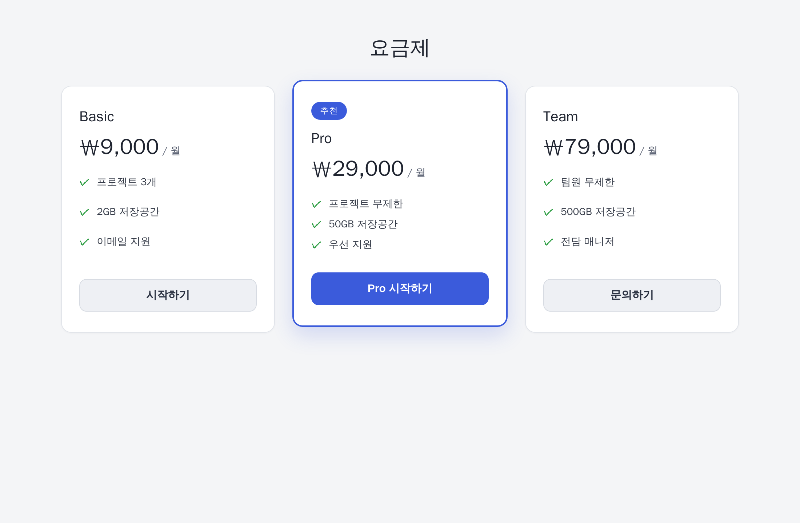
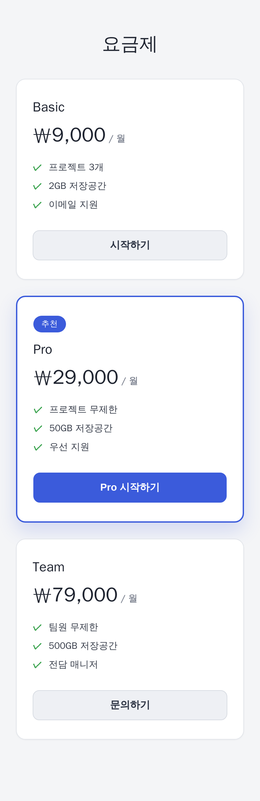

# 반응형 요금제 카드

`index.html`과 `styles.css`로 **요금제 3종을 카드로 나열한 섹션**을 구현하라.

## 예상 구현 결과

아래는 완성된 결과의 **예시 렌더링**이다(색·여백 등 디자인 디테일은 자유, 요구사항만 만족하면 된다).

**데스크톱 (폭 ≥ 768px)** — 카드 3개가 한 줄에 같은 너비로, 가운데 추천 카드가 강조된다.

**모바일 (폭 < 768px)** — 카드가 위에서 아래로 세로로 쌓인다.

레이아웃·반응형·추천 카드 강조는 위 예시대로 구현하면 된다. 채점에 필요한 마크업 규칙과 눈에 안 보이는 접근성 조건만 아래에 명시한다.

## DOM 계약 (채점 셀렉터)

- 요금제 카드는 정확히 **3개**, 각 카드 요소에 `data-testid="plan-card"` 속성을 둔다.
- 각 카드에는 **제목(`h2` 또는 `h3`)**, 가격, 기능 목록(`ul`), 그리고 **텍스트가 있는 `<button>`** 이 들어간다.
- 가운데 "추천" 요금제 카드에는 `data-featured` 속성을 둔다.
- **접근성** — 버튼에는 읽을 수 있는 이름이 있어야 하고, 제목 시맨틱을 지킨다(접근성 검사에서 심각/치명 위반 0건).

## 예제 테스트

`node tests/run_visible.js` 가 헤드리스 브라우저로 페이지를 띄워 기본 구조(카드 3개·제목·버튼)를 확인한다.

> 예제 테스트는 구조만 본다. 제출 채점은 데스크톱/모바일 레이아웃, 추천 카드 구분, 접근성까지 **렌더된 결과**로 검증한다.
